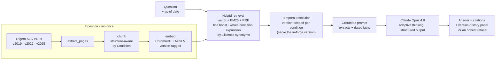

# RIA — Regulatory Intelligence Assistant

A grounded, **time-aware** question-answering assistant for UK energy regulation. Ask a
question about Ofgem's electricity-supply licence conditions — optionally *as of a past date* —
and RIA answers **only** from the licence text, cites the exact condition, tells you **how the
rule has changed over time**, and **refuses** when the answer isn't in the source material.

**🔗 Live demo:** [ria-ofgem.streamlit.app](https://ria-ofgem.streamlit.app) · embedded at
[scottdmarshall.com/ai-demo](https://www.scottdmarshall.com/ai-demo)
**👤 Built by:** [Scott Marshall](https://www.scottdmarshall.com)

> _Informational only — not legal advice. Grounded in public Ofgem consolidated licence
> conditions, which Ofgem flags as "not to be relied on" as the formal register._

> **Status:** proof-of-concept, scoped to the **electricity supply** licence. Gas supply licence
> conditions are the planned next phase (noted for later, not yet ingested).

---

## Why it's different

Most RAG demos answer from a single snapshot of a document. Regulation isn't a snapshot — it
**changes**, and the honest answer to "what did the rules say?" depends on *when* you're asking.
RIA's differentiator is **temporal awareness**: it holds three dated consolidations of the licence
and, for mapped conditions, serves the version of the text that was **in force on the date you ask
about** — with a visual timeline and a word-level diff of exactly what changed.

It handles three kinds of change:

| Kind | Example | What RIA does |
|---|---|---|
| **Introduced** | Cond 4D (protect credit balances), 25E (EBSS payments) | "Didn't exist as of 2021 — introduced 20 Sep 2023." |
| **Protections strengthened** | Cond 28 (prepayment meters — the 2023 involuntary-PPM reforms) | Serves the pre-reform text before 8 Nov 2023, the post-reform text after. |
| **Coverage widened** | Cond 0A (fair treatment — micro-business → *all* non-domestic, 1 Jul 2024) | Shows the "Micro Business Consumer → Non-Domestic Customer" swaps. |

Every answer is **grounded** (only from retrieved licence text), **cited** (condition + pages +
which consolidation), and **refused** when there's no adequate match — no hallucinated regulation.

---

## How it works



- **Retrieval is hybrid** — semantic (ChromaDB / `all-MiniLM-L6-v2`) fused with lexical (BM25) via
  Reciprocal Rank Fusion, with a condition-title field boost, whole-condition expansion so
  multi-part rules arrive complete, and a lay→licence synonym layer (e.g. "cutting off" →
  "disconnection") so everyday phrasing reaches the right condition.
- **Temporal resolution is per-condition** — each mapped condition has a verified, gap-free
  timeline; retrieval is restricted to the version whose text applied on the as-of date. Undated
  questions answer as of today (current version), so default behaviour is unchanged.
- **Refusal is LLM-judged** — the model decides whether the retrieved text actually answers the
  question, rather than relying on brittle distance thresholds.

---

## Evaluation

A deterministic + LLM-judged harness (`evals/`) grades a 31-case suite spanning obligations,
deadlines, paraphrases, out-of-scope refusals, and temporal edge cases:

| Metric | Result |
|---|---|
| Decision accuracy (answer vs refuse) | **31 / 31** |
| Retrieval hit-rate · recall@1 | 26/26 · 20/26 |
| Citation hit-rate | 26 / 26 |
| Temporal content · version-swap · history checks | 12/12 · 8/8 · 2/2 |
| **Faithfulness (independent LLM judge)** | **26 / 26 — 0 hallucinations** |
| Correct refusals · false answers | 5/5 · **0** |

The harness earned its keep: hardening the case set **surfaced two real weaknesses** — a false
refusal on a disconnection paraphrase (a large condition served incompletely) and a retrieval miss
of the Priority Services Register condition (a vocabulary gap) — which were then **fixed and
re-verified**. Full write-up: [`evals/report.md`](evals/report.md).

---

## Tech stack

- **Python** (3.14) in WSL2
- **[ChromaDB](https://www.trychroma.com/)** — vector store + built-in `all-MiniLM-L6-v2`
  embeddings (no PyTorch, no separate model server)
- **[rank_bm25](https://github.com/dorianbrown/rank_bm25)** — lexical retrieval for hybrid search
- **[Anthropic Claude](https://www.anthropic.com/)** (Opus 4.8) — grounded generation with adaptive
  thinking and structured JSON output
- **[Streamlit](https://streamlit.io/)** — UI, deployed on Streamlit Community Cloud
- **pypdf** — ingestion · **python-dotenv** — config (API key never committed)

## Repository layout

```
src/         ingestion + retrieval + generation
  versions.py     held-version registry ("current" = latest, no hardcoded date)
  temporal.py     per-condition change timelines (introduced / text-change)
  history.py      version-history view (timeline + word-level diff)
  detect_changes.py  change-detector: classifies every condition across versions
  rag.py          hybrid retrieval + grounded answer
app/main.py   Streamlit UI (question, answer, citations, version-history panel)
evals/        31-case suite, runner (recall@k + faithfulness judge), report
docs/         provenance, query taxonomy, change-map, deployment guide
```

## Run it locally

The vector store and chunks are committed, so **no re-ingestion is needed** to run the app.

```bash
git clone https://github.com/marshallsx/ragria.git && cd ragria
python3 -m venv venv && source venv/bin/activate
pip install -r requirements.txt
echo 'ANTHROPIC_API_KEY=sk-ant-...' > .env      # your Anthropic key
streamlit run app/main.py                        # → http://localhost:8501
```

Ask a grounded question from the CLI: `venv/bin/python src/rag.py "your question" [YYYY-MM-DD]`.
To rebuild the corpus from source PDFs: `extract_pages.py → chunk.py → embed.py` (see
[`docs/deployment.md`](docs/deployment.md)).

---

## Notable engineering decisions

- **Structure-aware chunking by Condition** (not fixed windows), with a completeness check — an
  end-to-end smoke query, not unit stats, is what caught a silent condition-merge parser bug.
- **Hybrid over pure-vector retrieval** — a weak-but-cheap embedder has vocabulary blind spots;
  BM25 + RRF + a title boost + lay→licence synonyms close them (measured, not assumed).
- **"Current" is a derived role, not a date** — a version registry makes the latest consolidation
  current automatically; there is no hardcoded "1 August 2025" anywhere in the serving path.
- **Per-condition, gap-free temporal model** — a mapped condition is in force for its whole life;
  only the *text* version changes. Conditions are chosen from a data-driven change-detector, then
  each change is confirmed against Ofgem's modification notices before mapping.
- **Faithfulness judging must see the full grounding** — an early groundedness judge that saw only
  the retrieved extracts false-flagged legitimate dated claims; feeding it everything the model saw
  fixed a misleading 10/25 to a true 26/26.

## Scope & limitations

- **Electricity *supply* licence conditions only** — this is a **proof-of-concept**; gas supply
  licence conditions are a planned next-phase extension (noted for later, not yet ingested), and
  other industry codes are out of scope.
- **Public Ofgem data only** — no confidential or proprietary material.
- Temporal coverage is **five mapped conditions** across three held consolidations; unmapped
  conditions answer from the current text and are honestly caveated on past-date queries.
- Consolidated PDFs are reference documents ("not to be relied on"); the assistant is
  **informational, not legal advice**.

---

_Built as a learning-first proof-of-concept to work through a complete RAG pipeline end-to-end —
ingestion, retrieval, grounded generation, evaluation, and deployment — and to explore
temporal/version awareness as the differentiator over a generic document chatbot._

---

**Built by [Scott Marshall](https://www.scottdmarshall.com)** · [Live demo](https://ria-ofgem.streamlit.app) · Public Ofgem data · Not legal advice

---

© 2026 Scott Marshall. All rights reserved. The source is published publicly for portfolio and demonstration purposes only — see [LICENSE](LICENSE). No reuse, modification, distribution, or resale without prior written permission.
